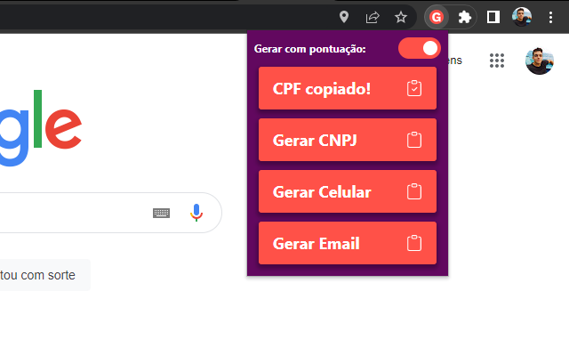

# Extensão Chrome - Gerador de Dados

Em breve na Chrome Web Store

## Instalação

`yarn`

## Gerando a build

`yarn build`

## Como carregar para o chrome

Carregue a pasta `dist` em `chrome://extensions/`, ao clicar no botão `Carregar sem compactação`

## Rodando testes

`yarn test`
